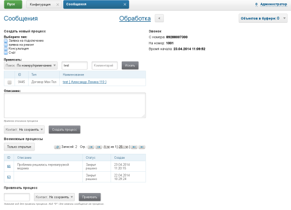

= About
:toc:

Full reference of AsciiDoctor syntax is available here: https://asciidoctor.org/docs/user-manual

== Second level header
Reference of selected blocks: https://asciidoctor.org/docs/user-manual/#style

NOTE: Note.

WARNING: Warning.

CAUTION: Take attention.

IMPORTANT: It is important.

Complex admonition blocks: https://asciidoctor.org/docs/asciidoc-syntax-quick-reference/#admon-bl

[IMPORTANT]
====
This is very important block.

Contains list items:
[square]
* One.
* Two.
====

List:
[square]
* Position 1
* Position 2

=== Third level header

== Tables

=== Simple example
[%header,cols=1*]
|===
|Service / Component

|Converter Service

|Index and Search Service

|===

=== Sample with joined cells
[cols="a,a", options="header"]
|===
|Key
|Description

// TODO: Line breaks doesn't work here.
|indexer.context.sharepoint.url
|:hardbreaks:
Root URL of SharePoint site.
Sample: https://sp.mycompany.i 
Sample Cloud: https://mycompany.sharepoint.com

|indexer.context.sharepoint.url.preprocess
|JS function for modifying URL before every request

2+|Sample: Requesting SP on different port.
[source]
----
indexer.context.sharepoint.request.url.preprocess:
    new Funct({process : function(url) {
      return url.replace("http://sp.mycompany.i", " https://sp.mycompany.i:555");
   }})
----

|indexer.context.sharepoint.user
|:hardbreaks:
SharePoint access user.
Sample: myuser 
Sample Cloud: myuser@mycompany.com
 
|===

== Code snippets
Configuration or another selected block of code (*source* adds horisontal scrolling if needed):
[source]
----
# при ошибке правки параметров - обновление таблицы с параметрами, необходимо в случае, если при этом другие параметры изменяются динамическим кодом
onErrorChangeParamsReload=1
# код параметра - категории, который должен быть указан перед переводом процесса в конечный статус
categoryParamId=<param_code>
# требование заполненности параметров перед установкой статуса, одна или несколько записей вида
requireFillParamIdsBeforeStatusSet.<status_to_code>=<param_codes>
----

Java code:
[source, java]
----
class My {
   private int a;
   
   public My() {
   		a = 5;
   }
}
----

== References
Image, must be always places in directory *_res* near of the file.

Big images may be restricted by width, recommended 600px for horizontal oriented и 300 vertical:

Link to JavaDoc of the class: javadoc:ru.bgerp.tool.asciidoc.DocGenerator[]

Another document: <<module/index.adoc#, Module>>

Chapter in another document: <<module/index.adoc#module-about, About>>

Use such links for referencing on not ready parts <<todo.adoc#, TODO>>, they may be easily found later.

Such link causes a validation error, may be used for marking not finished places:
[[source]]
----
<<todo, todo>>
----

== Selections
For any selection except of links use bold font: 
*variable* *path* *parameter* *interface => menu => item*

== Tools

