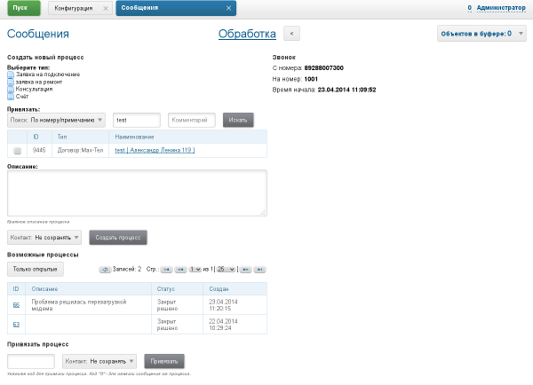

= Примеры
:toc:

Полное описание синтаксиса доступно здесь: https://asciidoctor.org/docs/user-manual

== Заголовок второго уровня
Полный список здесь: https://asciidoctor.org/docs/user-manual/#style

NOTE: Заметка.

WARNING: Предупреждение.

CAUTION: Обратить внимание.

IMPORTANT: Это важно.

Многострочные блоки: https://asciidoctor.org/docs/asciidoc-syntax-quick-reference/#admon-bl

[IMPORTANT]
====
Очень важный блок с предупреждением.

Содержит пункты:
[square]
* Раз.
* Два.
====

Список:
[square]
* Пункт 1
* Пункт 2

=== Заголовок третьего уровня

== Таблица

=== Пример простой

[%header,cols=1*]
|===
|Service / Component

|IntraFind Converter Service

|Index and Search Service

|===

=== Пример с объединением ячеек

[cols="a,a", options="header"]
|===
|Key
|Description

// TODO: Line breaks doesn't work here.
|indexer.context.sharepoint.url
|:hardbreaks:
Root URL of SharePoint site.
Sample: https://sp.mycompany.i 
Sample Cloud: https://mycompany.sharepoint.com

|indexer.context.sharepoint.url.preprocess
|JS function for modifying URL before every request

2+|Sample: Requesting SP on different port.
[source]
----
indexer.context.sharepoint.request.url.preprocess:
    new Funct({process : function(url) {
      return url.replace("http://sp.mycompany.i", " https://sp.mycompany.i:555");
   }})
----

|indexer.context.sharepoint.user
|:hardbreaks:
SharePoint access user.
Sample: myuser 
Sample Cloud: myuser@mycompany.com
 
|===

== Листинги

Конфигурация или иной выделенный фрагмент (*source* добавляет горизонтальный скроллинг):
[source]
----
# при ошибке правки параметров - обновление таблицы с параметрами, необходимо в случае, если при этом другие параметры изменяются динамическим кодом
onErrorChangeParamsReload=1
# код параметра - категории, который должен быть указан перед переводом процесса в конечный статус
categoryParamId=<param_code>
# требование заполненности параметров перед установкой статуса, одна или несколько записей вида
requireFillParamIdsBeforeStatusSet.<status_to_code>=<param_codes>
----

Java код:
[source, java]
----
class My {
   private int a;
   
   public My() {
   		a = 5;
   }
}
----

== Ссылки

Картинка, всегда в каталоге _res рядом с файлом.

Большие картинки можно ограничить по ширине, рекомендовано 600px для горизонтальных изображений и 300 для вертикальных:

Класс в системе: javadoc:ru.bgerp.tool.asciidoc.DocGenerator[]

Другой документ: <<kernel/extension.adoc#, Расширение>>

Другой документ, подраздел в нём: <<module/index.adoc#jexl, JEXL>>

Если должна быть внутренняя ссылка, но пока не готов документ, использовать <<todo.adoc#, TODO>>, их можно легко будет найти после.
Удобно ставить подобный признак в конце документа, находящегося в стадии написания, это позволяет легко копировать конструкцию в нужное место.

Подобная ссылка вызывает ошибки валидации, удобно ставить в документе, который находится в ходе разработки:
[[source]]
----
<<todo,todo>>
----

== Выделение

Для любых выделений кроме ссылок использовать полужирный шрифт: 
*переменная* *путь* *параметр* *пункт => меню => интерефейса*

