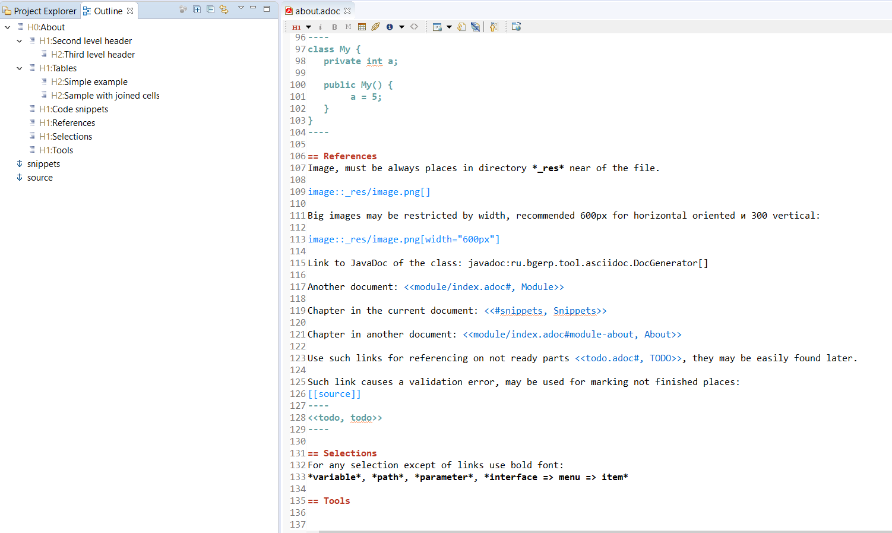

= Demo PzdcDoc
:toc:

[NOTE]
====
See this article published to HTML5: http://pzdcdoc.org/demo/src/doc/demo.html

The source page is: https://github.com/pzdcdoc/pzdcdoc/src/doc/demo.adoc
====

Full reference of AsciiDoctor syntax is available here: https://asciidoctor.org/docs/user-manual

== Second level header
Reference of selected blocks: https://asciidoctor.org/docs/user-manual/#style

NOTE: Note.

WARNING: Warning.

CAUTION: Take attention.

IMPORTANT: It is important.

Complex admonition blocks: https://asciidoctor.org/docs/asciidoc-syntax-quick-reference/#admon-bl

[IMPORTANT]
====
This is very important block.

Contains list items:
[square]
* One.
* Two.
====

List:
[square]
* Position 1
* Position 2

=== Third level header, description list
CPU::
Sometimes is needed for PC.
RAM::
Is also needed.

== Tables
=== Simple example
[%header,cols=1*]
|===
|Service / Component

|Converter Service

|Index and Search Service

|===

=== Sample with joined cells
[cols="a,a", options="header"]
|===
|Key
|Description

// TODO: Line breaks doesn't work here.
|indexer.context.sharepoint.url
|:hardbreaks:
Root URL of SharePoint site.
Sample: https://sp.mycompany.i 
Sample Cloud: https://mycompany.sharepoint.com

|indexer.context.sharepoint.url.preprocess
|JS function for modifying URL before every request

2+|Sample: Requesting SP on different port.
[source]
----
indexer.context.sharepoint.request.url.preprocess:
    new Funct({process : function(url) {
      return url.replace("http://sp.mycompany.i", " https://sp.mycompany.i:555");
   }})
----

|indexer.context.sharepoint.user
|:hardbreaks:
SharePoint access user.
Sample: myuser 
Sample Cloud: myuser@mycompany.com
 
|===

[[snippets]]
== Code snippets
=== Extracted "live snippets"
The source link below is automatically extracted to highlighted code snippet during HTML convertion.
Attributes `from` and `to` allow check actuality of content, `remove-leading` - deletion of line indent.
Here is the snippet of connecting plugins to DocGenerator.

[snippet, from="// h", to="r());", remove-leading="        "]
link:../main/java/org/pzdcdoc/DocGenerator.java#L73-L77[org.pzdcdoc.DocGenerator]

=== Simple snippets
Configuration or another selected block of code (*source* adds horisontal scrolling if needed):
[source]
----
# при ошибке правки параметров - обновление таблицы с параметрами, необходимо в случае, если при этом другие параметры изменяются динамическим кодом
onErrorChangeParamsReload=1
# код параметра - категории, который должен быть указан перед переводом процесса в конечный статус
categoryParamId=<param_code>
# требование заполненности параметров перед установкой статуса, одна или несколько записей вида
requireFillParamIdsBeforeStatusSet.<status_to_code>=<param_codes>
----

Java code:
[source, java]
----
class My {
   private int a;
   
   public My() {
   		a = 5;
   }
}
----

== References
=== Resources
Image, recommended to be places in directory `_res` near of the file.

image::_res/image.png[]

Big images may be restricted by width, recommended 600px for horizontal oriented и 300 vertical:

image::_res/image.png[width="600px"]

Any file from a project may be also referenced and automatically copied to `_res` subdirectory.

Content of class link:../main/java/org/pzdcdoc/Snippet.java[org.pzdcdoc.Snippet]

=== JavaDoc
Link to JavaDoc of the class: javadoc:ru.bgcrm.dao.user.UserDAO[]

=== Cross documents
References to `.adoc` files being converted to `.html` links and validated to corectness.

Another document: <<module/index.adoc#, Module>>

Chapter in the current document: <<#snippets, Snippets>>

Chapter in another document: <<module/index.adoc#module-about, About>>

Use such links for referencing on not ready parts <<todo.adoc#, TODO>>, they may be easily found later.

Such link causes a validation error, may be used for marking not finished places:
[[source]]
----
<<todo, todo>>
----

== Selections
For any selection except of links use bold font: 
*variable*, *path*, *parameter*, *interface => menu => item*

[[diagrams]]
== Diagrams
=== Embedded
Supported Ditaa and PlantUML diagrams.
[square]
* https://asciidoctor.org/docs/asciidoctor-diagram/
* https://asciidoctor.org/news/2014/02/18/plain-text-diagrams-in-asciidoctor/

Advantages:
[square]
* lightness;
* quick preview;
* simplicity and uniformity;
* storage and editing in the text of the document;
* no need to export.

==== Ditaa
http://ditaa.sourceforge.net/

Use http://asciiflow.com/ for editing.

[ditaa]
----
+------------------+       +---------------+
|                  |       |               |
|  Test for Adoc   +------>+   Diagrams    |
|                  |       |               |
+------------------+       +---------------+
----

=== With 3rd party editors
Schemas can also be produced using third-party editors, for example: link:https://www.yworks.com/downloads#yEd[yEd]
Source files are stored in `_res` directories under names ending in `_schema.graphml`.
Files have to be exported as images in PNG format, preferably with the same name. 
After any change source files have to be re-exported.

== Tools
AsciiDoctor may be edited in any text editor, but as more comfortable way I use an Eclipse plugin.

Features:
[square]
* structure preview in *Outline* section;
* hot keys like *Ctrl + b* for typical formatting options.

Preview I normally do not use, just do generation and refresh in the running browser.
