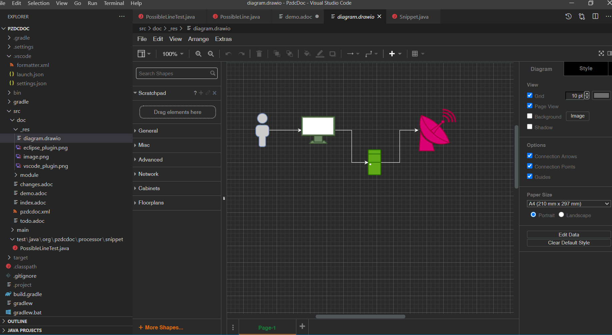
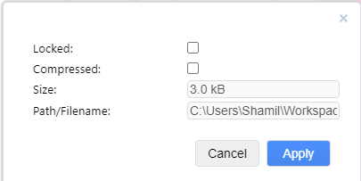
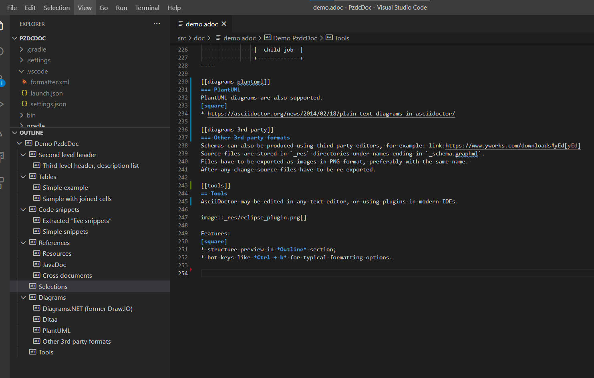

= Demo PzdcDoc
:toc:

ifndef::backend-html5[]
[NOTE]
====
See this article published to HTML5: https://pzdcdoc.org/demo/src/doc/demo.html
====
endif::[]

Full reference of AsciiDoctor syntax is available here: https://asciidoctor.org/docs/user-manual

== Second level header
Reference of selected blocks: https://asciidoctor.org/docs/user-manual/#style

NOTE: Note.

WARNING: Warning.

CAUTION: Take attention.

IMPORTANT: It is important.

Complex admonition blocks: https://asciidoctor.org/docs/asciidoc-syntax-quick-reference/#admon-bl

[IMPORTANT]
====
This is very important block.

Contains list items:
[square]
* One.
* Two.
====

List:
[square]
* Position 1
* Position 2

=== Third level header, description list
CPU::
Sometimes is needed for PC.
RAM::
Is also needed.

[[table]]
== Tables
[[table-simple]]
=== Simple example
[cols="1*", options="header"]
|===
|Service / Component

|Converter Service

|Index and Search Service
|===

[[table-proportional-cols]]
=== Proportional column widths
[cols="2,3,1", options="header"]
|===
|Header 2
|Header 3
|Header 1

|Column 2
|Column 3
|Column 1
|===

[[table-complex]]
=== Joined cells
[cols="a,a", options="header"]
|===
|Key
|Description

// TODO: Line breaks doesn't work here.
|indexer.context.sharepoint.url
|:hardbreaks:
Root URL of SharePoint site.
Sample: https://sp.mycompany.i
Sample Cloud: https://mycompany.sharepoint.com

|indexer.context.sharepoint.url.preprocess
|JS function for modifying URL before every request

2+|Sample: Requesting SP on different port.
[source]
----
indexer.context.sharepoint.request.url.preprocess:
    new Funct({process : function(url) {
      return url.replace("http://sp.mycompany.i", " https://sp.mycompany.i:555");
   }})
----

|indexer.context.sharepoint.user
|:hardbreaks:
SharePoint access user.
Sample: myuser
Sample Cloud: myuser@mycompany.com
|===

[[snippet]]
== Code snippets

[[snippet-live]]
=== Live Snippets
The source link below is automatically extracted to highlighted code snippet during HTML converting.
Attributes `from` and `to` allow check actuality of content, `remove-leading` - deletion of line indent.
Here is the snippet of connecting plugins to Generator.

// this snippet is used in PossibleLineTest, keep updated 'from' and 'to' variables there according to the current state after 'java#'
[snippet, from="// h", to="r());", remove-leading="        "]
link:../main/java/org/pzdcdoc/Generator.java#L113-L119[org.pzdcdoc.Generator]

[[snippet-simple]]
=== Simple Snippets
Configuration or another selected block of code (*source* adds horisontal scrolling if needed):
[source]
----
# при ошибке правки параметров - обновление таблицы с параметрами, необходимо в случае, если при этом другие параметры изменяются динамическим кодом
onErrorChangeParamsReload=1
# код параметра - категории, который должен быть указан перед переводом процесса в конечный статус
categoryParamId=<param_code>
# требование заполненности параметров перед установкой статуса, одна или несколько записей вида
requireFillParamIdsBeforeStatusSet.<status_to_code>=<param_codes>
----

Java code:
[source, java]
----
class My {
   private int a;

   public My() {
      a = 5;
   }
}
----

[[ref]]
== References

[[ref-res]]
=== Resources
Image, recommended to be places in directory `_res` near of the file.

image::_res/image.png[]

Big images may be restricted by width, recommended 600px for horizontal oriented и 300 vertical:

image::_res/image.png[width="600px"]

Any file from a project may be also referenced and automatically copied to `_res` subdirectory.

Content of class link:../main/java/org/pzdcdoc/processor/snippet/Snippet.java[org.pzdcdoc.processor.snippet.Snippet]

[[ref-javadoc]]
=== JavaDoc
Link to JavaDoc of the class: javadoc:ru.bgcrm.dao.user.UserDAO[]

[[ref-cross]]
=== Cross documents
References to `.adoc` files being converted to `.html` links and validated to corectness.

Another document: <<module/index.adoc#, Module>>

Chapter in the current document: <<#snippet, Snippets>>

Chapter in another document: <<module/index.adoc#module-about, About>>

Use such links for referencing on not ready parts <<todo.adoc#, TODO>>, they may be easily found later.

Such link causes a validation error, may be used for marking not finished places:
[[source]]
----
<<todo, todo>>
----

[[sel]]
== Selections
For any selection except of link:https://pzdcdoc.org[links] and `file names` use bold font:
*variable*, *path*, *parameter*, *interface / menu / item*

[[diagrams]]
== Diagrams

[[diagrams-drawio]]
=== Draw.IO
Using link:https://draw.io[Draw.IO] in software documentation allows to combine
text-based source format link:_res/diagram.drawio[stored] in same GIT repo with other and nice representation.

drawio::_res/diagram.drawio[width="600px", alt="Diagram Alt Text"]

Inline mode:
drawio:_res/diagram.drawio[width="600px", alt="Diagram Alt Text"]

Diagrams may be edited using the regular Diagrams.Net application or with IDE plugins like: https://marketplace.visualstudio.com/items?itemName=hediet.vscode-drawio

[IMPORTANT]
====
Source diagram files must *not* be compressed and free of references to library image resources, these requirements are checked during generation and reported as errors case of violation.
The *Compressed* checkbox can be found in the *File / Properties...* menu of the standard editor.

====

[[diagrams-drawio-renderer]]
==== DrawIO renderer
For converting DrawIO format to graphic files is used container:
https://hub.docker.com/r/tomkludy/drawio-renderer

Converter URL to there has to be defined in `pzdcdoc.xml` configuration file.

[snippet, from="<!-- co", to="-->", remove-leading="		"]
link:pzdcdoc.xml#L7-L11[src/doc/pzdcdoc.xml]

[CAUTION]
====
The value used there points to our test server. Keeping it in production configurations is strictly unrecommended.
All the data from your diagrams may be analyzed with AI in Cambridge Analytics, therefore start your own container using the
command below and use it instead.
====

[source]
----
docker run -d -p 5000:5000 --shm-size=1g --name drawio-renderer --restart always tomkludy/drawio-renderer:v1.1
----

After running a container uncomment the second block in the configuration above.

[[diagrams-3rd-party]]
=== Other 3rd party formats
Schemas can also be produced using third-party editors, for example: link:https://www.yworks.com/downloads#yEd[yEd]
Source files are stored in `_res` directories under names ending in `_schema.graphml`.
Files have to be exported as images in PNG format, preferably with the same name.
After any change source files have to be re-exported.

[[tools]]
== Tools
AsciiDoctor may be edited in any text editor, or using plugins in modern IDEs.

Features:
[square]
* structure preview in *Outline* section;
* syntax highting;
* spell checking;
* hot keys for typical formatting options.

[[tools-vscode]]
=== link:https://marketplace.visualstudio.com/items?itemName=asciidoctor.asciidoctor-vscode[VSCode Plugin]

[[tools-eclipse]]
=== link:https://marketplace.eclipse.org/content/asciidoctor-editor[Eclipse Plugin]

image::_res/eclipse_plugin.png[]
